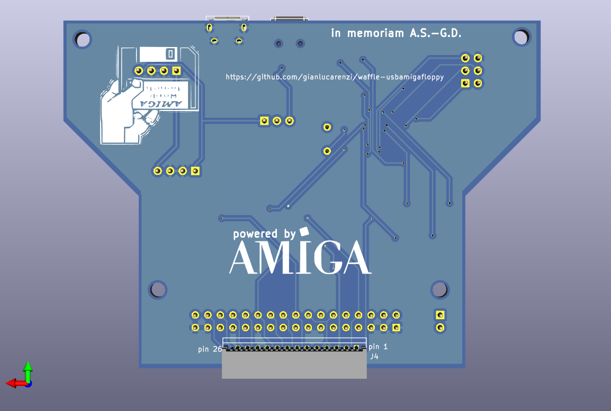
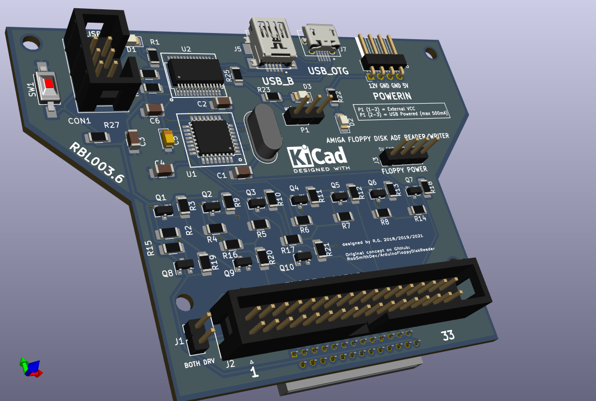

USB floppy controller for Amiga disks
=====================================

This is a USB floppy disk controller, for reading and writing amiga ADF disks. In
conjunction with the ArduinoFloppyDiskReader. The .zip file containing the executable
usable in Windows OS can be downloaded from:

https://github.com/gianlucarenzi/ArduinoFloppyDiskReader/blob/master/ArduinoFloppyReader/ArduinoFloppyReaderWin/res/ADFReaderWriter22.zip

It allows archiving amiga disks as ADF disk images, or writing ADF disk images back to disks, to use
with an Amiga computer (real or emulated).

The firmware for this controller is based on the same project by Rob Smith (https://github.com/RobSmithDev/ArduinoFloppyDiskReader),
converted to run on standalone AVR hardware (as opposed to an arduino) by John
Tsiombikas, and slightly adapted for my new hardware project.

The new AVR hardware is designed to be compatible with the original host
software, so you may use the `AmigaFloppyReader` or `AmigaFloppyReaderWin`
programs from Rob's project, if you prefer.

Directory structure:

  * `hw` - hardware: kicad files and pdf schematics.
  * `fw` - firmware for the AVR microcontroller and FTDI chips
  * `amigafloppy` - host program for reading/writing ADF images.

Note: The `amigafloppy` host program is not completed yet. And it's not a high
priority, since Rob's original .NET programs seem to work fine with wine on
GNU/Linux. I'd like to complete it at some stage, but I can't say when that will
happen. Contributions are of course welcome, but please coordinate with me
first. Until then, please use `AmigaFloppyReader` or `AmigaFloppyReaderWin`.

Rendered Images
===============
# Front
# Back
# Overall

Hardware License
================
Copyright (C) 2018/2021 Gianluca Renzi <gianlucarenzi@eurek.it> <icjtqr@gmail.com>

Original work Copyright (C) 2018 John Tsiombikas <nuclear@member.fsf.org>

The hardware of this project is released as free/open hardware under the
Creative Commons Attribution Share-Alike license. See `LICENSE.hw` for details.

Firmware License
================
Copyright (C) 2017 Rob Smith <rob@robsmithdev.co.uk>

Copyright (C) 2018 John Tsiombikas <nuclear@member.fsf.org>

Copyright (C) 2018/2021 Gianluca Renzi <icjtqr@gmail.com>

The microcontroller firmware of this project is released as free software,
under the terms of the GNU General Public License v3, or later.  See
`LICENSE.sw` for details.

Software License
================
Copyright (C) 2018 John Tsiombikas <nuclear@member.fsf.org>

The host software (amigafloppy tool) is released as free software, under the
terms of the GNU General Public License v3, or later. See `LICENSE.sw` or licence.txt for
details.
